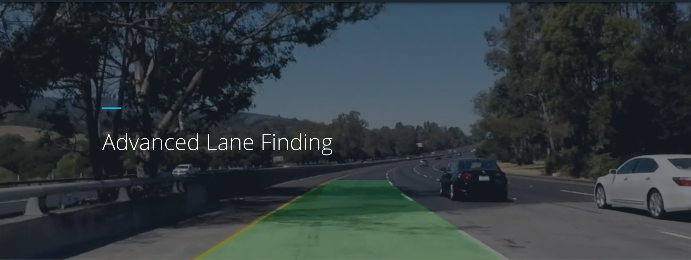
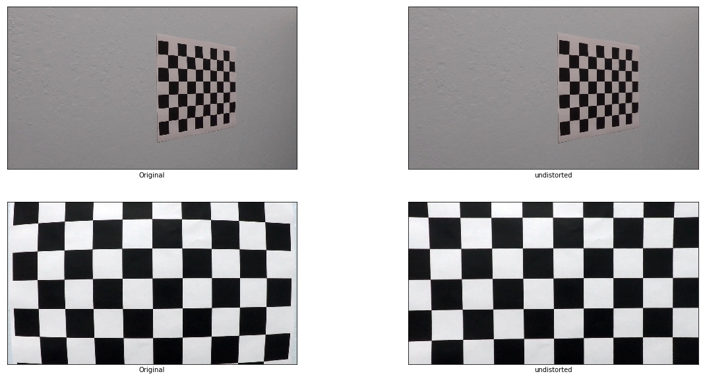
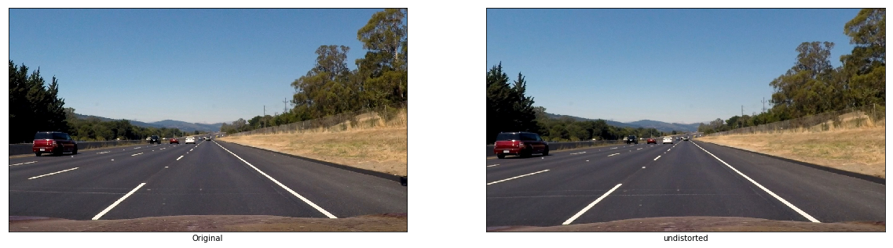
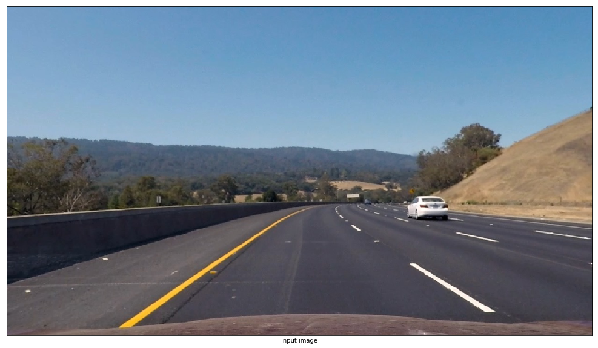
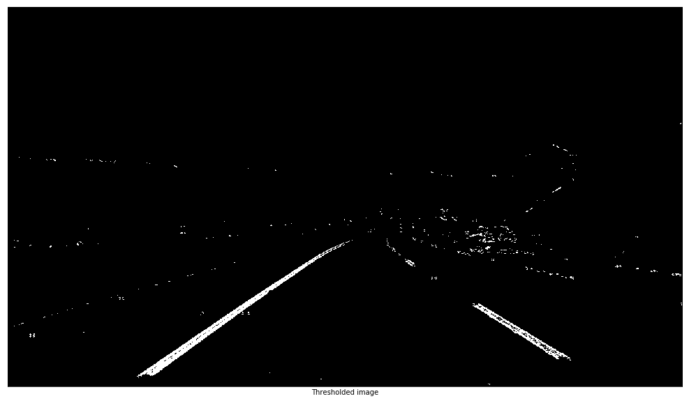
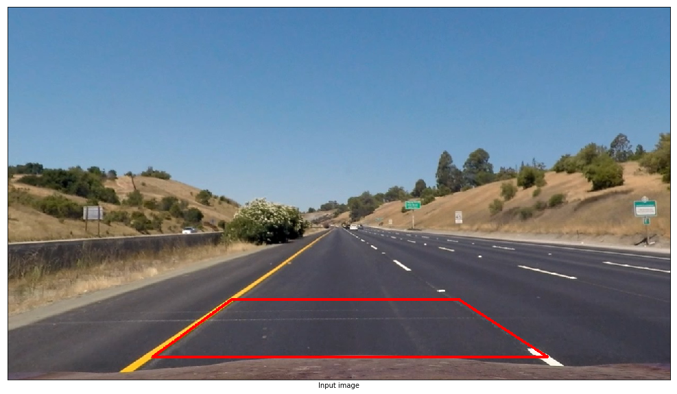
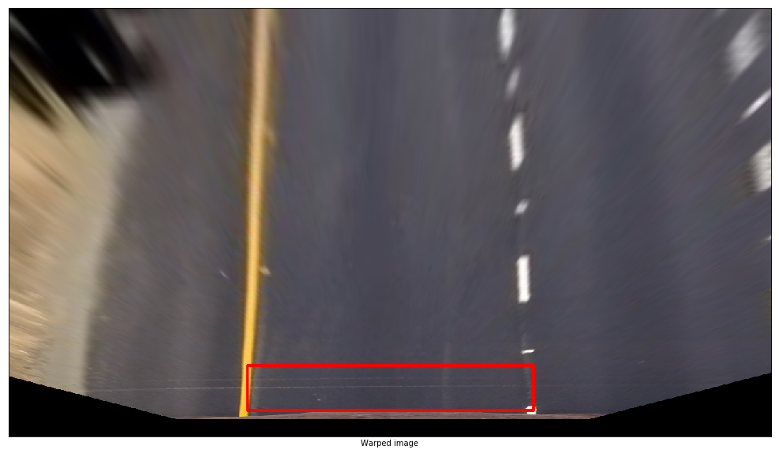
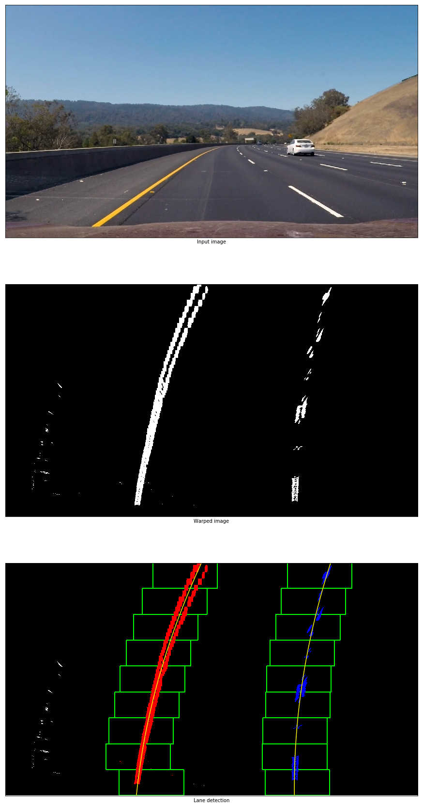
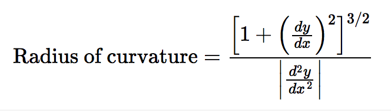
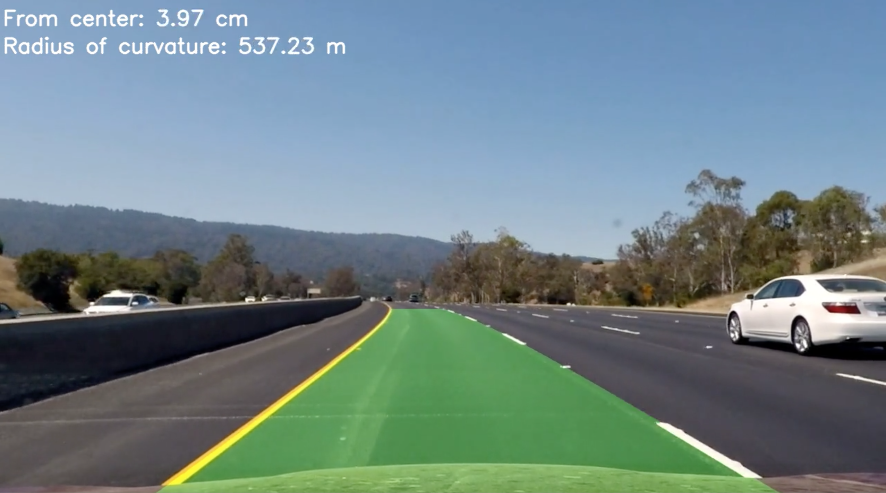

# Udacity Advanced Lane Finding Project


## 1. Introduction

In this project the goal is to find lane boundaries in a video from a front-facing camera on a car.

## 2. Camera Calibration
Each manufactured camera is a little different and the image they produce geometricly distorted images. Fortunately the camera can be calibrated and images can be undistorted.

To calculate the camera calibration parameters, a set of images of a well known pattern can be taken, and the distinct points on that images can be compared with the ground truth of the pattern.

We will use a chessboard image taken at different angles.

First step is to identify the chessboard corners. To use the the openCV function `findChessboardCorners` the images need to be converted to grayscale:

```python
gray = cv2.cvtColor(img, cv2.COLOR_BGR2GRAY)
ret, corners = cv2.findChessboardCorners(gray, (nx,ny), None)
```

The corners that were found can be fed into cv2.calibrateCamera function along with the object points that define the coordinates of the reference chessboard. `calibrateCamera` then will find the mapping between the image points (detected corners) and the reference object point.

```python
# Do camera calibration given object points and image points
ret, mtx, dist, rvecs, tvecs = cv2.calibrateCamera(objpoints, imgpoints, img_size, None, None)
```

`mtx` contains the calibration matrix and `dist` has the distortion coefficients with which we can undistord the images:

```python
undistorted = cv2.undistort(image, mtx, dist, None, mtx)
```
The following image shows samples of undistorted images with the use of calculated parameters:




## 2. Thresholding
In this section we will preprocess the incoming image to output regions that are likely where the lane markings are. The typical steps include:

1) Undistorting the image.
An example below: (Visible changes: shape of the hood of the car, red car on the left)



2) Create a thresholded binary image to filter out the lane markings. This operation will not fully isolate the lane markings. This will addressed in the next step.

Since we know that the lane markings are close to vertical, we can make use of this knowledge. Similar to the canny operator we can use the sobel operator to extract the gradients and will apply thresholds on the direction and magnitude of the gradients. Further we will apply threshold in the HLS color domain to get a more robust detection than thresholding in the RGB color space.

This is the part of the code how the different thresholded images were combined into a single binary thresholded image.

```python
	# gradx = Threshold binary image in the x direction of the gradients
	# grady = Thresholded binary image in the y direction of the gradients
	# mag_binary = Thresholded binary image by magnitude of the gradients
	# dir_binary = Thresholded binary image by the direction of the gradients
	
    combined = np.zeros_like(dir_binary)
    combined[((gradx == 1) & (grady == 1)) | ((mag_binary == 1) & (dir_binary == 1)) | (((color_binary == 1) & (dir_binary == 1)))] = 1

```

Sample output of the thresholding:



3) With the perspective transformation the binary thresholded image can be converted to a birdseye view image. Further calculations can be performed with this image. To calculate this, I chose source and destination points and used the `warpPerspective` function provided by the openCV library.

```python
srcPts = np.int32([
    [871, 565],   # top right
    [1042, 676],  # bottom, right
    [279, 676],   # bottom, left
    [432, 565]    # top left
])

dstPts = np.int32([
    [880, 600],   # top right
    [880, 676],  # bottom, right
    [400, 676],   # bottom, left
    [400, 600]    # top left
])
```
Below examples on how the chosen points were overlayed on the input and warped images:




## 3. Identifying lane-line pixels

The thresholded binary image can be further processed to identify the actual lane markings. To do this a sliding window of histogram calculation was applied, to detect the left and right lanes (highest peak on each side). A curve was fit for each side (In this case a polynomial of second order). An example for the result of the fit and the detection of the sliding windows is plotted below:



Since the left and right lane markings are near vertical the fitted function was calculated for f(y) values instead of f(x).

### Radius of curvature

Now that we have a polynomial fit describing the lane markings we can calculate the radius of the curvature of this function at a given point. The radius of curvature of the curve at a particular point is defined as the radius of the approximating circle. The formula is as follows:



Applying the formula yields a radius in pixels. The calculation needs to be done after correcting for scale in x and y with:

```python
# Define conversions in x and y from pixels space to meters
ym_per_pix = 30/720 # meters per pixel in y dimension
xm_per_pix = 3.7/700 # meters per pixel in x dimension
```
The calculations has been performed on the closest point to the car on the lane markings (Point wit highest y value on the lane fit function).

### Position of the vehicle
The position of the vehicle with respect to the lane center can be calculated. For the calculation I first determined the center of the lane as well as the position of the camera. Under the assumption that the camera is installed right in the middle of the windshield the vehicle x-position can be determined with

```python
vehicle_center_pix = image.shape[1]/2.0
```
Using the lane fit functions we can also determine the center of the lane with:

```python
lane_center_pix = left_pix + (right_pix - left_pix)/2.0
```

With this the position of the vehicle from the lane center would be:

```python
pos_from_center_pix = (lane_center_pix - vehicle_center_pix)
```

The calculated values are in pixels. The metric value can be calculated as:

```python
xcm_per_pix = (3.7/700)*100 # centimeters per pixel in x dimension
pos_from_center_pix_cm = pos_from_center_pix * xcm_per_pix
```

A final output example of the pipeline is shown below:



The final result video can be found [here](../code/project_result.mp4).

## Discussion

Although using the thresholding in the HLS color space, the robustness of the detection could be highly affected by the contrast variation. The thresholds were chosen arbitrary and a better approach would be to use a dynamic threshold calculation.
Also this algorithm alaways expects to find a left and a right lane marking. If the markings are not available, a wrong are would be identified. There are better checks needed to cover these extreme cases.
